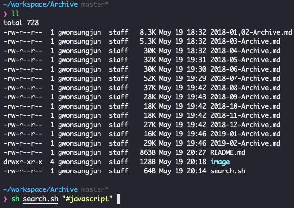
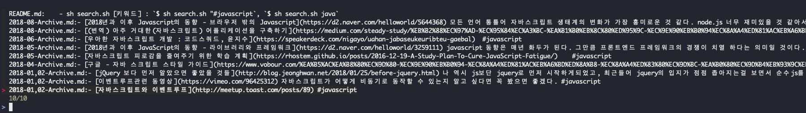

# 📚 Archive
- 매달 읽었던 글을 요약 및 정리해서 아카이빙하는 REPO
- 글마다 핵심 키워드를 해시태그(#)로 정의해놓았기 때문에 검색 시 유용

## 사용법
1. (필수) [fzf](https://github.com/junegunn/fzf)를 설치한다.
    - [fzf installation](https://github.com/junegunn/fzf#installation)을 참고하여 각자의 운영체제에 맞게끔 설치한다.
    - ex) Using Homebrew
    
    ```shell
    brew install fzf
    
    # To install useful key bindings and fuzzy completion:
    $(brew --prefix)/opt/fzf/install
   ```
 
2. 해당 저장소를 로컬로 내려 받는다. `$ git clone https://github.com/gwonsungjun/Archive.git`
3. Project 루트의 `search.sh`을 통해 찾고 싶은 키워드를 검색한다.
    - sh search.sh [키워드] : `$ sh search.sh "#javascript"`, `$ sh search.sh java`



